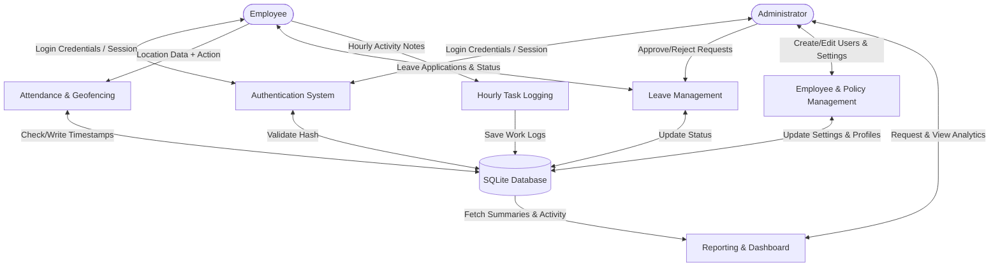

# HR Management System

A robust, Flask-based HR Management System featuring dedicated portals for both Employees and Administrators. The system is designed to handle daily attendance tracking (with geofencing), leave management, hourly work logging, and administrative reporting.

## Features

### 👨‍💼 Employee Portal
- **Dashboard**: Personalized workspace showing today's attendance, leave summaries, and recent notices.
- **Attendance & Geofencing**: Check-in and check-out tracking. If enabled, geofencing ensures employees can only mark attendance when within a specified radius of the office location.
- **Hourly Work Schedule**: Log tasks and progress on an hourly basis throughout the workday.
- **Leave Management**: Apply for leaves, provide reasons, and track the approval status of past requests.
- **Profile Management**: Update personal details, emergency contacts, and upload a profile picture.
- **Company Policies & Notices**: Stay up to date with official rules, office closures, and announcements.

### 🔐 Admin Control Panel
- **Employee Management**: Add, edit, or deactivate employee profiles. Assign departments, roles, and manage portal access credentials.
- **Real-time Dashboard**: Snapshot of today's HR metrics—total present, on leave, absent, and late arrivals.
- **Attendance Management**: View daily or monthly attendance records and manually override or correct entries if needed.
- **Leave Approvals**: Review, approve, or reject employee leave requests. View individual streak snapshots and absentee flags.
- **Department Reports**: Deep dive into department-wise daily work boards and track individual employee hourly task logs.
- **System Settings**: Configure global policies including:
  - Workday start and logout times.
  - Late mark thresholds.
  - Default allocated casual and sick leaves.
  - Office latitude, longitude, and geofence radius for attendance validation.
- **Activity Logs**: Audit trail of administrative and user actions across the system.
- **Backup & Export**: Export monthly attendance reports to CSV format.

## Tech Stack

- **Backend**: Python, Flask
- **Database**: SQLite3
- **Frontend**: HTML templates (Jinja2), CSS, JavaScript
- **Authentication**: Session-based auth with hashed passwords (`werkzeug.security`)

## Getting Started

### Prerequisites
- Python 3.8 or higher installed on your machine.

### Installation

1. **Clone the repository or extract the files.**

2. **Install the required Python packages:**
   ```bash
   pip install flask werkzeug
   ```

3. **Initialize the Database:**
   Run the database script to create the necessary SQLite tables, triggers, and default settings.
   ```bash
   python database.py
   ```
   This will create a `database.db` file in the root directory.

4. **Run the Application:**
   ```bash
   python app.py
   ```
   The Flask development server will start at `http://127.0.0.1:5000/`.

## Default Credentials

Upon initializing the database for the first time, a default administrator account is created:

- **Admin Login URL**: `http://127.0.0.1:5000/admin/login`
- **Email**: `admin@company.com`
- **Password**: `Admin@123`

> **Note:** It is highly recommended to change the admin password or create a new admin account and deactivate the default one before using this in production.

## Database Schema

The SQLite database (`database.db`) consists of several interconnected tables mapped to the system's logic:

| Table Name | Description |
| :--- | :--- |
| **`employees`** | Core employee profile details (`emp_code`, `full_name`, `department_id`, `role_id`, `status`, `profile_image`, etc.) |
| **`users`** | Employee portal login credentials, hashed passwords, and session data. |
| **`admin_users`** | Administrator login credentials and profiles. |
| **`departments`** & **`roles`** | Lookup tables defining the organizational structure. |
| **`attendance`** | Daily check-in/out records, work hours, late flags, and attendance statuses. |
| **`leave_requests`** | Employee leave applications, date ranges, reasons, and admin approval tracking. |
| **`employee_hourly_notes`** | Logs of task descriptions submitted by employees throughout their workday. |
| **`activity_logs`** | System-wide audit trail recording actions taken by both admins and employees (along with timestamps and IP addresses). |
| **`system_settings`** | Global dynamic configuration (e.g., office geolocation, leave limits, workday timings). |
| **`notifications`** | Published office announcements, alerts, and holiday closures. |

## Data Flow Diagram (DFD)

Below is a high-level (Level 1) Data Flow representation of the entire HR Management System:



## Project Structure

- `app.py`: Main Flask application containing all routing logic.
- `config.py`: Application configuration, environment variables, and default settings.
- `database.py`: Database initialization script.
- `modules/`: Contains modularized backend logic for authentication (`admin_auth.py`, `employee_auth.py`) and database schema helpers (`schema.py`).
- `templates/`: Jinja2 HTML templates for the frontend.
- `static/`: Static assets (CSS, JS, Uploaded Profile Pictures)!
